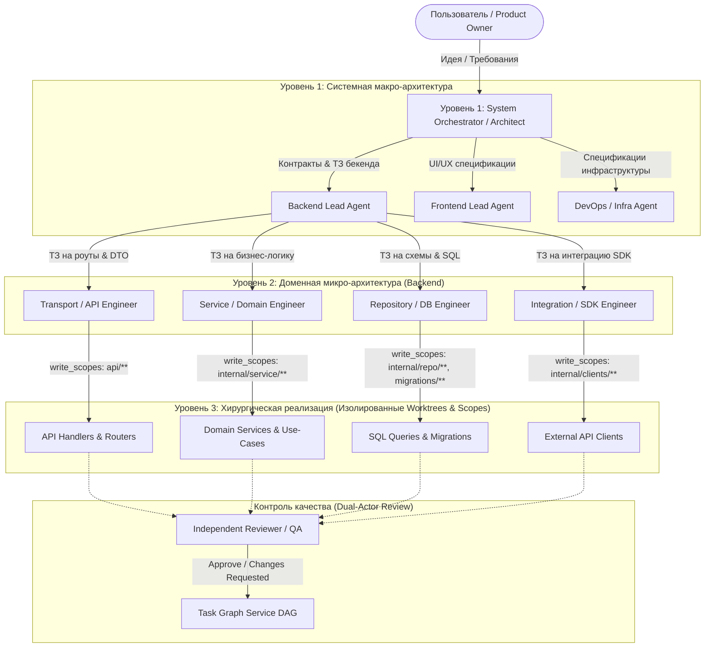
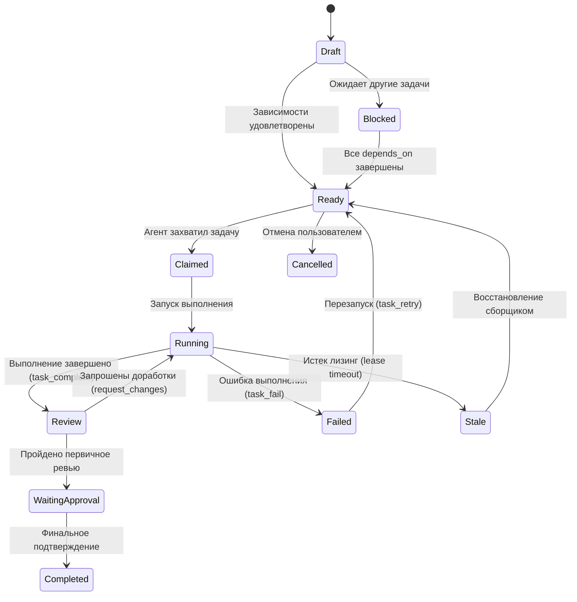

# Архитектура: Zed Multi-Agent Execution Runtime & Task Graph Service (TGS)

Форк превращает Zed из индивидуального редактора в **высокопроизводительный Execution Runtime и IDE для иерархических мультиагентных систем разработки ПО**. В основе архитектуры лежит парадигма **«Лестницы абстракций» (The Ladder of Abstractions)**, позволяющая декомпозировать сложные инженерные задачи от общей продуктовой идеи до хирургической реализации в изолированных слоях кодовой базы.

---

## 1. Парадигма «Лестницы абстракций» (The Ladder of Abstractions)

### Проблема плоских и монолитных агентов
Классические coding-агенты оперируют в плоском пространстве контекста:
- **Размывание фокуса и галлюцинации**: одна модель пытается одновременно удерживать в голове архитектуру базы данных, верстку интерфейса, сетевые контракты и бизнес-правила.
- **Смешение уровней абстракций**: рассуждения о высокоуровневой логике приложения перебиваются деталями синтаксиса конкретных SQL-миграций или CSS-селекторов.
- **Отсутствие изоляции записи**: агент, которому поручено исправить логику авторизации, случайно модифицирует файлы роутинга, конфигурацию линтера или клиентский код.
- **Невозможность строгого контроля качества**: монолитный агент проверяет сам себя, что регулярно приводит к ложноположительным подтверждениям («саморевью»).

### Решение: Иерархическая лестница абстракций
Вместо попытки решить задачу одним агентом система выстраивает **рекурсивную иерархию специализированных агентов**, каждый из которых ограничен своим уровнем понятий, каталогом доступных инструментов и жестким файловым периметром (`write_scopes`).



### Слои лестницы:
1. **Уровень 1: Системный архитектор (System Orchestrator / Lead Architect)**:
   - **Вход**: Общее описание задачи или фичи от пользователя.
   - **Абстракции**: Макро-компоненты системы (`backend`, `frontend`, `infrastructure`, `documentation`).
   - **Ответственность**: Формирование архитектурного плана, межсистемных контрактов (OpenAPI, Protobuf, JSON-схемы), декомпозиция на крупные функциональные блоки.
   - **Действие**: Создает задачи верхнего уровня в TGS и делегирует их специализированным доменным агентам через `spawn_agent(profile="backend", ...)`. Сам код руками не пишет (доступ к файлам только на чтение либо только к `docs/**`, `specs/**`).

2. **Уровень 2: Доменный специалист (Domain Lead, например Backend Lead)**:
   - **Вход**: Техническое задание и контракты интерфейсов для своей подсистемы.
   - **Абстракции**: Архитектурные слои домена (Layered / Hexagonal / Clean Architecture):
     - *Транспортный слой* (HTTP-хендлеры, gRPC-методы, DTO, валидация запросов).
     - *Сервисный слой* (бизнес-логика, доменные модели, use-cases).
     - *Слой персистентности / репозиториев* (структуры таблиц, SQL-запросы, миграции, транзакции).
     - *Слой внешних интеграций* (клиенты сторонних SDK, брокеры сообщений, внешние API).
   - **Ответственность**: Проектирование взаимодействия слоев внутри своего домена.
   - **Действие**: Декомпозирует задачу на атомарные подзадачи для каждого слоя, регистрирует зависимости в TGS DAG и запускает агентов соответствующего слоя.

3. **Уровень 3: Инженеры конкретных слоев (Layer / Component Engineers)**:
   - **Вход**: Узкое, детальное ТЗ на реализацию конкретного контракта.
   - **Абстракции**: Конкретный программный код слоя (функции, структуры, интерфейсы, юнит-тесты).
   - **Безопасность**: Заблокированы от изменения файлов чужих слоев через `write_scopes` (например, агент репозиториев физически не может изменить HTTP-роутер или CSS).
   - **Действие**: Реализуют код, запускают точечные тесты (`terminal` с белым списком команд), публикуют артефакты и отправляют задачу на ревью.

4. **Кросс-доменный контроль качества (Dual-Actor Review)**:
   - Независимый агент с профилем `reviewer` или `qa-engineer` проверяет соответствие результата исходным контрактам и критериям приемки.
   - Исключено саморевью: автор задачи не имеет права ее утвердить.

---

## 2. Оригинальный Zed IDE Harness vs Инновации Форка

Форк не изобретает заново работу с кодом, а опирается на сильные стороны оригинального **Zed Agent Harness**, кардинально трансформируя его возможности:

| Возможность | Оригинальный Zed Harness | Настоящий Форк |
|---|---|---|
| **Архитектура агентов** | Одноуровневый диалог с пользователем; плоские, неизолированные вызовы | **Рекурсивная «Лестница абстракций»**: многоуровневая иерархия агентов с четкими ролями |
| **Глубина делегирования** | `spawn_agent` ограничен глубиной 1; субагенты не могли порождать других субагентов | **Рекурсивный `spawn_agent`** с глубиной до 5 уровней, валидацией DFS-графа и пулом слотов |
| **Управление профилями** | Фиксированные системные профили с общими правами | **Декларативные профили** в `.zed/settings.json`, файловые промпты, Project-shadowing |
| **Файловая безопасность** | Все инструменты редактирования имеют доступ ко всем файлам ворктри | **Per-tool `write_scopes` & защита dotfiles**: хирургические ограничения записи, защита всех скрытых файлов/папок (`.env`, `.github/`, `.cargo/`) и изоляция в песочнице терминала |
| **Песочница и права** | Интерактивные подтверждения (`Confirm`) блокируют автономный ход | **Fail-Closed политика**: блокировка интерактивных запросов для автономных агентов |
| **Координация задач** | Отсутствует; агент работает в рамках одного открытого треда | **Task Graph Service (TGS)**: внешний Go MCP-сервер, 12 состояний, DAG, лизинг |
| **Параллельная работа** | Все субагенты делят одну рабочую директорию (конфликты файлов) | **Изоляция в Git Worktrees**: каждый агент работает в изолированной ветке `agent-task/{task_id}` |
| **Отказоустойчивость** | Ошибка `429 Too Many Requests` или сетевой сбой приводят к сбою сессии | **Адаптивная парковка**: экспоненциальный backoff до 5 часов без потери истории треда |
| **Фильтрация скиллов** | Все скиллы доступны всем сессиям глобально | **3-уровневая фильтрация скиллов** с политикой **default-deny** для кастомных профилей |
| **Конфигурация среды** | Статические переменные окружения | Автозагрузка `.env` и динамическая подстановка `${VAR:-default}` в модели и MCP |

### Что дает оригинальный Zed Harness как подложка:
- **Сверхбыстрый нативный GPUI рантайм на Rust**: обработка событий с околонулевыми задержками и минимальным потреблением оперативной памяти.
- **Глубокая интеграция с состоянием редактора**: прямой доступ к буферам в памяти, синтаксическим деревьям Tree-sitter, языковым серверам (LSP) и диагностикам компилятора.
- **Унифицированный протокол агентов (ACP)**: стандартизированная шина общения между UI-компонентами и бэкендами потоков (`Thread`, `AcpThread`).
- **Богатый набор нативных инструментов**: `read_file`, `edit_file`, `write_file`, `terminal`, `grep`, `find_path`, `copy_path`, `move_path`, `delete_path`.

---

## 3. Трехуровневая архитектура системы

Система строго разделена на три слоя ответственности:

```text
┌─────────────────────────────────────────────────────────────────────────┐
│                           REASONING LAYER                               │
│  LLM Провайдеры: Claude, GPT, DeepSeek, Local Ollama    │
│  Понимание контекста, декомпозиция ТЗ, синтез кода, выбор профилей       │
└────────────────────────────────────▲────────────────────────────────────┘
                                     │ Запросы / Стриминг токенов
┌────────────────────────────────────▼────────────────────────────────────┐
│                       ZED AGENT RUNTIME (EXECUTION)                     │
│  • Рекурсивный spawn_agent & SubagentSlotPool (до 5 уровней)            │
│  • Декларативные профили и файловые промпты (.zed/prompts/)             │
│  • Fail-Closed безопасность, Tool Permissions и Write Scopes            │
│  • Изоляция выполнения задач в отдельных Git Worktrees                  │
│  • Адаптивная парковка Rate-Limit (429) и сетевых ошибок                │
│  • Agent Task Panel UI (ListTodo, Diff, Timeline)                       │
└────────────────────────────────────▲────────────────────────────────────┘
                                     │ JSON-RPC 2.0 (stdio) / MCP
┌────────────────────────────────────▼────────────────────────────────────┐
│                    TASK GRAPH SERVICE (CONTROL PLANE)                   │
│  • Автономный демон на Go (cmd/taskgraph) с хранилищем SQLite WAL       │
│  • Управление целями (Goals) и ациклическим DAG задач (Tasks)           │
│  • 12-состояний стейт-машины задач и pull-based планировщик             │
│  • Распределенный лизинг с heartbeat и фоновым сборщиком Stale-воркеров │
│  • Dual-Actor Review: гарантия независимой верификации (без саморевью)  │
│  • Неизменяемые версионированные артефакты и append-only аудит событий  │
└─────────────────────────────────────────────────────────────────────────┘
```

---

## 4. Декларативные профили и файловые промпты

Профиль агента задает его место на лестнице абстракций, разрешенные направления делегирования, системные инструкции и периметр доступа.

### Декларативная конфигурация (`settings.json` / `.zed/settings.json`)
```jsonc
{
  "agent": {
    "default_profile": "orchestrator",
    "task_graph_server_id": "tgs",
    "nested_sub_agents": {
      "enabled": true,
      "max_depth": 3,
      "max_concurrent": 8
    },
    "profiles": {
      // Уровень 1: Оркестратор / Системный архитектор (максимальный reasoning)
      "orchestrator": {
        "name": "System Architect",
        "description": "Decomposes project requirements into system abstractions and coordinates domain leads",
        "permission_mode": "autonomous", // "interactive" | "autonomous" | "unrestricted"
        "custom_prompt_path": ".zed/prompts/orchestrator.md",
        "default_model": {
          "provider": "anthropic",
          "model": "claude-sonnet-latest",
          "enable_thinking": true
        },
        "delegation": {
          "allowed": ["backend-lead", "frontend-lead", "infra-lead"],
          "max_depth": 3
        },
        "tool_permissions": {
          "default": "deny",
          "tools": {
            "read_file": { "default": "allow" },
            "grep": { "default": "allow" },
            "find_path": { "default": "allow" },
            "list_directory": { "default": "allow" },
            "edit_file": {
              "default": "allow",
              "write_scopes": ["docs/**", "specs/**", "proto/**"]
            },
            "write_file": {
              "default": "allow",
              "write_scopes": ["docs/**", "specs/**", "proto/**"]
            }
          }
        }
      },

      // Уровень 2: Доменный специалист (баланс архитектурной логики и скорости)
      "backend-lead": {
        "name": "Backend Lead",
        "description": "Designs backend architecture and delegates to layer engineers",
        "permission_mode": "autonomous",
        "custom_prompt_path": ".zed/prompts/backend_lead.md",
        "default_model": {
          "provider": "anthropic",
          "model": "claude-sonnet-latest"
        },
        "skills": ["go", "postgres", "architecture"],
        "delegation": {
          "allowed": ["transport-engineer", "repository-engineer", "service-engineer"],
          "max_depth": 2
        },
        "tool_permissions": {
          "default": "deny",
          "tools": {
            "read_file": { "default": "allow" },
            "grep": { "default": "allow" },
            "find_path": { "default": "allow" },
            "edit_file": { "default": "allow", "write_scopes": ["backend/api/**", "backend/internal/domain/**"] },
            "write_file": { "default": "allow", "write_scopes": ["backend/api/**", "backend/internal/domain/**"] }
          }
        }
      },

      // Уровень 3: Инженер слоя хранения данных (быстрая кодовая модель)
      "repository-engineer": {
        "name": "Repository & DB Engineer",
        "description": "Implements SQL queries, migrations, and database repository logic",
        "custom_prompt_path": ".zed/prompts/repository_engineer.md",
        "default_model": {
          "provider": "anthropic",
          "model": "claude-haiku-latest"
        },
        "skills": ["sql", "postgres-migrations"],
        "tool_permissions": {
          "default": "deny",
          "tools": {
            "read_file": { "default": "allow" },
            "grep": { "default": "allow" },
            "find_path": { "default": "allow" },
            "edit_file": {
              "default": "allow",
              "write_scopes": ["backend/internal/repository/**", "backend/migrations/**"]
            },
            "write_file": {
              "default": "allow",
              "write_scopes": ["backend/internal/repository/**", "backend/migrations/**"]
            },
            "terminal": {
              "default": "deny",
              "always_allow": [
                { "pattern": "^go\\s+test\\s+\\./backend/internal/repository/\\.\\.\\." },
                { "pattern": "^migrate\\s+up" }
              ],
              "always_deny": [{ "pattern": "rm\\s+-rf" }, { "pattern": "git\\s+push" }]
            }
          }
        }
      },

      // Уровень верификации: Ревьюер (альтернативная модель для кросс-проверки)
      "reviewer": {
        "name": "Code Reviewer",
        "description": "Reviews completed tasks against acceptance criteria",
        "custom_prompt_path": ".zed/prompts/reviewer.md",
        "default_model": {
          "provider": "openai",
          "model": "gpt"
        },
        "tools": {
          "edit_file": false,
          "write_file": false,
          "terminal": false
        }
      }
    }
  }
}
```

### Файловая архитектура промптов
1. **Конвенция автоматического поиска**:
   Если путь не указан явно, runtime проверяет файл `.zed/prompts/{profile_id}.md` (внутри проекта) или `{config_dir}/prompts/{profile_id}.md` (глобально).
2. **Безопасность идентификаторов (`is_safe_profile_id`)**:
   Имена профилей проверяются на отсутствие символов обхода директорий (`..`, `/`, `\`), предотвращая directory traversal атаки.
3. **Редактирование в редакторе Zed**:
   В интерфейсе **Manage Profiles** нажатие на редактирование инструкций открывает соответствующий `.md` файл напрямую во вкладке редактора, создавая его по шаблону при отсутствии.
4. **Шаблонизация системного промпта Handlebars (`system_prompt.hbs`)**:
   Промпт компилируется строго по слоям:
   - Базовые системные директивы Zed.
   - Документация доступных инструментов.
   - **Динамический каталог делегирования (`available_agents`)**: агент видит список и описания **только тех профилей**, которые разрешены в его `delegation.allowed`.
   - Окружение, рабочая директория и песочница терминала.
   - Каталог разрешенных скиллов (`<available_skills>`).
   - Пользовательские правила (`AGENTS.md`, `.rules`).
   - Специализированные инструкции профиля (`custom_prompt_path`).
   - Контекст текущей задачи TGS (Task ID, критерии приёмки, write scopes).

---

## 5. Движок рекурсивного делегирования (`spawn_agent`)

### Контроль графа делегирования (`AgentGraph`)
При загрузке настроек модуль `AgentGraph` выполняет статическую верификацию графа вызовов:
- **Поиск циклов (Cycle Detection)**: итеративный DFS-алгоритм обнаруживает циклические зависимости (например, `A -> B -> A` или `A -> B -> C -> A`) и выбрасывает ошибку конфигурации до запуска агентов.
- **Проверка достижимости**: предотвращает вызовы несуществующих или скрытых профилей.
- **Solo-профили**: профиль без блока `delegation` не может запускать профилированных субагентов.

### Управление ресурсами: Семафор `SubagentSlotPool`
Для защиты от исчерпания ресурсов и параллельного шторма запросов к LLM:
- Дерево сессий от корневого агента разделяет единый атомарный счетчик слотов `SubagentSlotPool`.
- Ограничение контролируется параметром `agent.nested_sub_agents.max_concurrent` (по умолчанию 16).
- Ресурс удерживается объектом `SubagentSlotGuard` и гарантированно освобождается при завершении или отмене хода.
- Глубина вложенности отслеживается по счетчику `current_depth` и визуализируется в UI через префикс заголовка (например, `[d2] Implement DB Layer`).

---

## 6. Control Plane: Task Graph Service (TGS)

Task Graph Service — это независимый легковесный сервис координации, реализованный на Go (`cmd/taskgraph`) и взаимодействующий с Zed по стандартному протоколу MCP (JSON-RPC 2.0 stdio).

### Жизненный цикл задачи (12 состояний)



### Ключевые механизмы TGS:
- **Pull-Based планировщик**: агенты не опрашивают друг друга напрямую, а атомарно забирают готовые задачи через `task_claim`.
- **Лизинг и Heartbeat**: запущенная задача удерживается воркером на время действия аренды. Воркер регулярно отправляет `agent_heartbeat`. При сбое воркера задача переходит в `STALE` и автоматически возвращается в пул сервисом `recovery.Worker`.
- **Dual-Actor Safety**: завершивший задачу агент переводит ее в `REVIEW`. Тот же агент не может утвердить свою задачу; ревью проводит отдельный профиль `reviewer` либо человек через Task Panel.
- **Неизменяемые артефакты**: результаты работы публикуются через `artifact_publish` с SHA-256 хешами и версионированием через `supersedes`.

---

## 7. Безопасность автономных агентов: Fail-Closed & Write Scopes

Безопасность автономной работы опирается на строгую эшелонированную защиту (Defense-in-Depth) с явным управлением режимом авторизации (`permission_mode`):

### Режимы авторизации профилей (`AgentPermissionMode`)
- **`interactive`** (псевдоним `"prompt"`): диалоговый режим парного программирования. Если для инструмента нет явного правила `allow`, рантайм запрашивает подтверждение у пользователя через UI-диалог.
- **`autonomous`** (псевдоним `"strict"`): полностью автономный режим (Fail-Closed). Запросы к пользователю исключены. Любое действие без явного разрешения или требующее подтверждения немедленно блокируется (`PolicyDenied`). Если секция `tool_permissions` не указана — блокируются все вызовы.
- **`unrestricted`** (псевдоним `"allow_all"`): режим полного доверия для изолированных окружений. Все вызовы разрешены автоматически без запросов (за исключением неизменяемых системных запретов).

При отсутствии явного `permission_mode` действует автоматический fallback: при наличии `tool_permissions` — `"autonomous"`, при отсутствии — `"interactive"`.

### Поток авторизации вызовов инструментов

```text
Входящий вызов инструмента
       │
       ▼
1. Hardcoded Запреты ────────────► [rm -rf /, ~, .., shell sub-command injection] ──► DENY
       │ (пройдено)
       ▼
2. Проверка Unrestricted ────────► permission_mode == Unrestricted? ───────────────► ALLOW
       │ (нет)
       ▼
3. Autonomous без правил ────────► permission_mode == Autonomous && no tool_perms? ─► DENY
       │ (пройдено)
       ▼
4. Global Deny ──────────────────► [always_deny из настроек пользователя] ─────────► DENY
       │ (пройдено)
       ▼
5. Правила профиля ──────────────► always_deny / always_confirm / always_allow
       │
       ├── Исход "Confirm" ──────► Autonomous? ──► [Fail-Closed] ──────────────────► DENY
       │
       ▼ (разрешено)
6. Write Scopes ─────────────────► Файловый инструмент? (edit, write, copy, move, etc.)
       │                           Совпадает с явным write_scopes?
       │                           ├── Нет и вне write_scopes ─────────────────────► DENY
       │                           └── Да (входит в write_scopes) ─────────────────► ALLOW (override)
       ▼
7. Anti-Privilege-Escalation ────► Доступ к dotfiles / .zed/** / global config / skills?
       │                           ├── Явно разрешён в write_scopes? ──────────────► ALLOW
       │                           ├── Autonomous (без явного write_scope) ────────► DENY (PolicyDenied)
       │                           └── Interactive (без явного write_scope) ───────► PROMPT (User UI)
       ▼
8. Anti-Escape (Симлинки) ───────► Выход за пределы ворктри через symlink?
       │                           ├── Autonomous ─────────────────────────────────► DENY (PolicyDenied)
       │                           └── Interactive ────────────────────────────────► PROMPT (User UI)
       ▼
Вызов разрешен и отправлен на исполнение
```

### Правила и гарантии:
- **Fail-Closed для автономных профилей**: если агент работает в режиме `autonomous`, любое действие, требующее интерактивного подтверждения пользователем (`Confirm`), немедленно отклоняется с ошибкой `PolicyDenied`. Автономный агент не повисает бесконечно в фоне.
- **Защита dotfiles и конфигурации (Dotfiles & Settings Protection)**: все скрытые файлы и директории проекта (`.github/`, `.env*`, `.cargo/`, `.husky/`, `.vscode/`, `.zed/` и др.), глобальный конфиг и навыки (`~/.agents/skills/`) защищены от несанкционированной модификации:
  - Все мутирующие инструменты (`edit_file`, `write_file`, `delete_path`, `create_directory`, `copy_path`, `move_path`) классифицируют dot-пути как чувствительные (`SensitiveSettingsKind::Hidden`), предотвращая обход через `..`-traversal и внутрипроектные симлинки.
  - В интерактивном режиме изменение dot-файлов всегда требует подтверждения пользователя через UI (`{title} (hidden / configuration file)`), даже при `default: "allow"`.
  - В автономном режиме модификация dot-путей отклоняется (`PolicyDenied`), если целевой путь не указан явно в `write_scopes` профиля (например, `write_scopes: [".github/**"]` для CI-инженера).
  - В терминале существующие скрытые файлы и директории верхнего уровня воркспейса включаются в `protected_paths` песочницы и монтируются в режиме read-only на уровне ОС (`--ro-bind` в Linux bwrap, `deny file-write*` в macOS seatbelt).
- **Explicit Write Scopes Override**: явное указание пути в `write_scopes` профиля (например, `[".github/**"]` или `[".zed/**"]`) служит легитимным оверрайдом и разрешает модификацию без интерактивных диалогов.
- **Per-Tool Write Scopes**: glob-шаблоны ограничивают область действия файловых инструментов. Ошибка в шаблоне также вызывает fail-closed блокировку.
- **Re-entrant Borrow Safety**: валидация прав инструмента выполняется без повторных мутабельных заимствований структур треда через удержание `Entity<Project>`, исключая паники рантайма при фоновых событиях.

---

## 8. Изоляция выполнения: Git Worktrees и Task Panel

Для полноценной многоагентной параллельной разработки разделения на уровне логики недостаточно — требуется изоляция на уровне файловой системы.

- **Автоматические Git Worktrees**: при запуске задачи TGS runtime создает независимую Git-ветку `agent-task/{task_id}` и отдельный каталог worktree `agent-task-{task_id}`.
- **Отсутствие конфликтов файлов**: параллельно работающие субагенты (например, инженеры API и базы данных) пишут в изолированные деревья файлов, исключая порчу недописанного кода друг друга.
- **Task Panel UI**: специализированная панель задач (док настраивается отдельно через `agent.task_dock`) предоставляет:
  - Иерархическое дерево целей, задач и подзадач со статусами и счетчиками попыток (`#attempt`).
  - Быстрый просмотр дифф-патча задачи относительно базовой ветки (`View Task Diff`).
  - Интерактивные действия: запуск, принудительное утверждение, запрос доработок, повтор.
  - Живая лента хронологии событий задачи (`AgentTaskTimeline`).

---

## 9. Отказоустойчивость: Адаптивная парковка (Rate-Limit & Connection Drops)

При длительной автономной разработке программных решений сбои сети или превышение лимитов запросов к API провайдеров (`429 Too Many Requests`) неизбежны.

Вместо аварийного падения дорогостоящего дерева агентов реализован механизм **адаптивной парковки**:
- **Умный экспоненциальный опрос**: интервалы ожидания автоматически масштабируются: `60с -> 120с -> 240с -> 300с` (максимум) в пределах настраиваемого бюджета времени (по умолчанию 5 часов).
- **Сетевая устойчивость**: парковка срабатывает не только на статус `429`, но и на внезапные обрывы HTTP-потоков и ошибки сетевого сокета.
- **Сохранение контекста**: полный диалог, история инструментов и состояние субагентов консервируются в памяти. В интерфейсе появляется таймер обратного отсчета с кнопками отмены и ручного перезапуска.

---

## 10. Трёхуровневая система скиллов и окружение

- **3-уровневая фильтрация скиллов**:
  1. Каталог `<available_skills>` в системном промпте.
  2. Автодополнение slash-команд в UI.
  3. Инструмент `skill` блокирует прямые неавторизованные вызовы.
  Для кастомных профилей без списка `skills` действует строгий **default-deny**.
- **Интеграция с `.env`**:
  Файл `.env` в корне проекта автоматически читается при открытии и отслеживается на изменения. Подстановка переменных вида `${VAR}` и `${VAR:-default}` доступна в конфигурациях MCP-серверов (`command.env`, `command.args`) и в идентификаторах языковых моделей, защищая секреты от фиксации в репозитории.

---

## 11. Архитектура проектной директории `.zed`, окружения `.env` и локальных MCP

### Проектная директория `.zed/`
В данном форке директория `.zed/` выступает ядром проектной спецификации рантайма:
- `.zed/settings.json`: проектные настройки (`SettingsStore`), переопределяющие глобальные параметры пользователя. Определяет реестр MCP-серверов (`context_servers`), корневой профиль по умолчанию (`default_profile`), модели (`default_model`, `subagent_model`), глобальные политики (`tool_permissions`) и декларативные профили агентов (`profiles`).
- `.zed/prompts/`: хранилище системных промптов и специализированных инструкций профилей (`*.md`). Профиль автоматически связывается с файлом `.zed/prompts/{profile_id}.md` (или явным `custom_prompt_path`).
- `.zed/mcp/`: хранилище изолированных локальных MCP-серверов с платформенными бинарниками и собственными SQLite базами данных:
  - `agent-bus/`: шина асинхронного обмена сообщениями и обратной связи (`messages.db`, `topics.jsonc`).
  - `taskgraph/`: Control Plane сервис графа задач TGS (`taskgraph.db`, `taskgraph.log`).
- `.zed/tasks.json` и `.zed/debug.json`: проектные задачи сборки/тестирования и конфигурации DAP-отладчика.

### Жизненный цикл и безопасность `.env`
1. **Инициализация (`WorktreeStore::create_local_worktree`)**: при монтировании локального ворктри редактор проверяет наличие `.env` в корне проекта, парсит переменные и загружает их в процесс (`util::load_env`).
2. **Горячая перезагрузка (`project_settings.rs`)**: файловый вотчер отслеживает путь `.env`. Любое сохранение файла вызывает реактивную перезагрузку переменных и `SettingsStore::reload(cx)`, мгновенно актуализируя подстановки `${VAR}` без перезапуска Zed.
3. **Защита критических переменных ОС**: переменные `PATH`, `HOME`, `USER`, `USERNAME`, `SHELL`, `SYSTEMROOT` никогда не перезаписываются из `.env`, если они уже присутствуют в системе.
4. **Безопасность секретов**:
   - Файл `.env` включен в список `private_files` Zed (закрыт от прямого чтения LLM).
   - Классифицирован как скрытый чувствительный файл (`SensitiveSettingsKind::Hidden`). Автономные агенты не могут мутировать `.env` (`PolicyDenied`).
   - В терминале монтируется в режиме read-only на уровне песочницы ОС.
5. **Шаблон конфигурации**: эталонный файл с описанием всех переменных расположен в `docs/.env.example`.

### Архитектура и протокол взаимодействия с MCP-серверами
1. **Регистрация в `context_servers`**:
   - Локальные сервисы используют кроссплатформенные маппинги (`platforms` с поддержкой `darwin-arm64`, `linux-amd64`, `windows-amd64.exe` и др.).
   - Внешние сервисы подключаются через `npx` (`@skills-hub-ai/mcp`, `@mcpfinder/server`) либо по HTTP/SSE протоколам.
2. **Подключение к профилям и авторизация**:
   - Профиль явно декларирует доступные ему MCP-серверы и инструменты в `context_servers.<server_id>.tools`.
   - Права на вызовы регулируются через `tool_permissions.tools["mcp:<server_id>:<tool_name>"]` с поддержкой Fail-Closed политики в автономном режиме.
3. **Подробное руководство пользователя**:
   Полная инструкция по настройке и работе с добавленными MCP доступна в **[docs/multi-agent-setup.md](./docs/multi-agent-setup.md)**.
