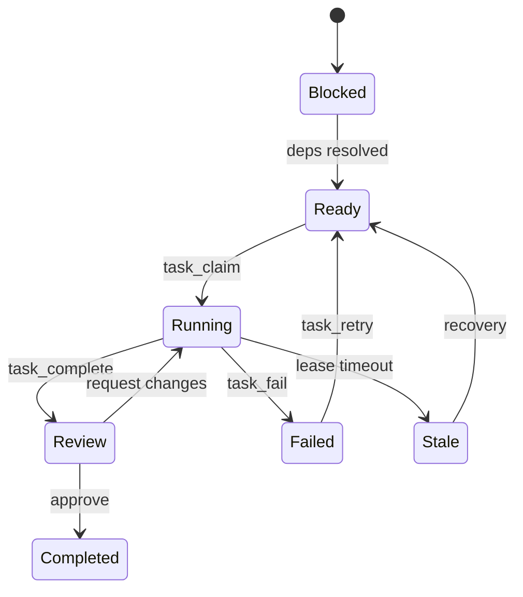

# Архитектура: Zed Agent Runtime + Task Graph Service (TGS)

Форк превращает Zed в IDE и runtime для иерархии автономных coding-агентов. Ответственность жёстко разделена между тремя слоями:

| Слой | Отвечает за |
|---|---|
| **Zed** (Execution Layer) | Профили агентов, жизненный цикл сессий (`Thread` / `AcpThread` / `NativeAgent`), иерархическое делегирование (`spawn_agent`), безопасность (`tool_permissions`, `write_scopes`, fail-closed), изоляцию задач в Git Worktree, песочницу терминала, UI панелей |
| **TGS** (Control Plane) | Цели (Goals), DAG задач с валидацией циклов, стейт-машина задач, контракты, лизинг с heartbeat, двухфазное ревью, неизменяемые артефакты, append-only аудит |
| **LLM** (Reasoning Engine) | Понимание контекста, декомпозиция задач, выбор целевого профиля агента, архитектура и реализация кода |

Zed и TGS общаются по протоколу MCP (JSON-RPC 2.0, stdio). [TGS](https://github.com/blaise-pov/tgr) — независимый демон на Go с хранилищем SQLite WAL; ключ сервера в `context_servers` задаётся настройкой `agent.task_graph_server_id` (по умолчанию `tgs`) и применяется без перезапуска.

```text
USER ──► Zed UI (Agent Panel / Agent Task Panel)
              │
              ├── Agent Runtime: профили, сессии, spawn_agent,
              │   tool_permissions, write_scopes, worktrees, песочница
              │
              └── McpAgentTaskProvider ──► TGS MCP Server:
                  задачи, DAG, лизинг, ревью, артефакты, события
```

---

## 1. Агент — это профиль Zed

Агент определяется декларативно в `settings.json` — глобальном или в `.zed/settings.json` проекта (настройки проекта дополняют и переопределяют пользовательские; такие профили помечаются бейджем **Project** в UI). Редактирование — в JSON или через **Agent Panel → Manage Profiles**.

```jsonc
{
  "agent": {
    "default_profile": "feature-dev",
    "system_prompt_template": ".zed/prompts/system_prompt.hbs",
    "thread_title_template": ".zed/prompts/thread_title.txt",
    "task_graph_server_id": "tgs",
    "nested_sub_agents": {
      "enabled": true,
      "max_depth": 3,
      "max_concurrent": 16
    },
    "profiles": {
      "backend": {
        "name": "Backend Agent",
        "description": "Implements backend business logic, storage and APIs",
        "custom_prompt_path": ".zed/prompts/backend.md",
        "default_model": { "provider": "anthropic", "model": "claude-sonnet-4-latest" },
        "skills": ["go", "postgres", "rest-api"],
        "delegation": {
          "allowed": ["repository-engineer", "transport-engineer"],
          "max_depth": 2
        },
        "tool_permissions": {
          "default": "deny",
          "tools": {
            "terminal": {
              "default": "deny",
              "always_allow": [{ "pattern": "^go\\s+(test|build|vet)" }],
              "always_deny": [{ "pattern": "^git\\s+push\\s+--force" }]
            },
            "edit_file": { "default": "allow", "write_scopes": ["backend/**", "proto/**"] },
            "write_file": { "default": "allow", "write_scopes": ["backend/**", "proto/**"] }
          }
        }
      }
    }
  }
}
```

Параметры профиля:

| Параметр | Назначение |
|---|---|
| `name` / `description` | Имя в UI; описание роли для каталога делегирования родительского агента |
| `custom_prompt_path` | Путь к файлу специализированных системных инструкций (абсолютный, `~/`, относительно корня ворктри/проекта или каталога конфигурации Zed; поддерживаются алиасы `custom_prompt_file`, `prompt_path`, `prompt_file`). Если путь не задан, действует соглашение об автоматическом поиске `.zed/prompts/{profile_id}.md` (в проекте) или `{config_dir}/prompts/{profile_id}.md` (глобально) |
| `system_prompt_template` | Путь к кастомному базовому Handlebars-шаблону системного промпта (переопределяет глобальный `agent.system_prompt_template` для данного профиля) |
| `default_model` | LLM-модель профиля (поддерживает подстановку `${VAR}`) |
| `skills` | Белый список скиллов; для кастомных профилей без списка действует **default-deny** (нет скиллов), встроенные видят все |
| `delegation` | Правила делегирования: `allowed` (список разрешённых профилей) и `max_depth` (1–5); без блока — спавн только агентов без профиля (с глубиной 1) |
| `tool_permissions` | Политики инструментов: `default`, `always_allow` / `always_deny` (regex), `write_scopes` (glob) |
| `tools` | Включение и выключение отдельных инструментов для профиля (`{"tool_name": true/false}`) |
| `context_servers` | Пресеты context-серверов профиля; флаг `enable_all_context_servers` управляет их включением по умолчанию |

**Ключевые принципы конфигурации:**

- **TGS не хранит содержимое профилей**: задача в графе ссылается на целевой профиль полем `assigned_profile = "backend"`.
- **Ключи раскладки окон (`dock`, `task_dock`, `flexible`) — всегда пользовательские**: проектные настройки (`.zed/settings.json`) их игнорируют (очищаются через `clear_layout_keys`), чтобы файл настроек в репозитории не двигал окна у участников команды.
- **Изоляция настроек проекта**: настройки агентов и профили вычисляются для конкретного `SettingsLocation` (по проекту и ворктри активного треда). Профили из разных проектов не попадают в глобальную область видимости и не влияют друг на друга.
- **Редактирование промптов в UI**: при настройке системного промпта через **Agent Panel → Manage Profiles** редактор открывает файл инструкций (`.zed/prompts/{profile_id}.md` или настроенный `custom_prompt_path`) напрямую во вкладке рабочей области Zed, автоматически создавая файл при его отсутствии.

---

## 2. Делегирование: две независимые операции

1. **Регистрация подзадачи в TGS** (MCP): `task_create` с контрактом, `assigned_profile`, `write_scopes` и `depends_on`. TGS валидирует DAG и переводит задачу в `READY`.
2. **Запуск агента в Zed** (встроенный инструмент): `spawn_agent(profile, task_id, label, message)`.

Runtime Flow при `spawn_agent`:

- **Статическая валидация графа** — `AgentGraph` при загрузке настроек проверяет граф делегирования алгоритмом поиска в глубину (DFS) на циклы и ссылки на несуществующие профили.
- **Проверка прав и глубины** — наличие права на инструмент `spawn_agent`. Для спавна профилированного агента необходимо явное вхождение в `delegation.allowed`; без блока `delegation` разрешён спавн только агентов без профиля (с глубиной 1). Действуют лимиты `delegation.max_depth` и глобального `agent.nested_sub_agents` (`enabled`, `max_depth` 1–5, `max_concurrent` 1–32, по умолчанию 16).
- **Семафор конкурентности** — атомарный `SubagentSlotPool`, общий на всё дерево сессий от корня, освобождает слот при завершении или отмене вызова.
- **Изолированный тред** — `Thread::new_subagent` со своей моделью, скиллами, `write_scopes` и связанным журналом действий; дочерний агент сохраняет профиль даже при смене профиля родителем, продолжение диалога — по `session_id`. В UI карточка подагента в `ThreadView` наглядно отображает бейдж назначенного профиля.

```text
Root (orchestrator)
  ├── TGS: task_create(assigned_profile="backend")  ──► TASK-1
  └── Zed: spawn_agent(profile="backend", task_id="TASK-1")
        ├── TGS: task_create(parent=TASK-1, profile="repository-engineer") ──► TASK-2
        └── TGS: task_create(parent=TASK-1, profile="transport-engineer",
                             depends_on=["TASK-2"])                      ──► TASK-3
```

---

## 3. Сборка системного промпта

Базовый Handlebars-шаблон (`system_prompt.hbs`) компилирует промпт в строго фиксированном порядке:
1. Базовые системные инструкции Zed.
2. Руководство по инструментам.
3. Каталог делегирования (список разрешённых профилей с их `description`).
4. Системная информация (ОС, shell, worktrees).
5. Описание песочницы терминала.
6. Информация о модели.
7. Каталог доступных скиллов `<available_skills>`.
8. Пользовательские инструкции (`AGENTS.md`, `.rules` каждого ворктри).
9. Инструкции профиля (`## Profile Instructions`), загружаемые из файла `custom_prompt_path` либо по соглашению из `.zed/prompts/{profile_id}.md` / `{config_dir}/prompts/{profile_id}.md`.
10. Контекст задачи (Task ID, критерии приёмки, write scopes).

Шаблон компиляции промпта можно кастомизировать глобально через `agent.system_prompt_template` или локально для профиля через `system_prompt_template`.

Пути к файлам промптов разрешаются относительно корня активного ворктри, домашней директории (`~/`) или каталога настроек Zed. Идентификаторы профилей валидируются (`is_safe_profile_id`), что исключает атаки обхода директорий (`..`, `/`, `\`) при автопоиске промптов.

Для автоматической генерации названий тредов настройка `agent.thread_title_template` позволяет указать путь к текстовому шаблону (например, `.zed/prompts/thread_title.txt`), полностью замещающему встроенный промпт суммаризации.

---

## 4. Task Graph Service (Control Plane)

TGS — легковесный демон на Go (`cmd/taskgraph`), MCP-сервер по JSON-RPC 2.0 (stdio) на SQLite WAL с ACID-транзакциями.

Доменная модель: `goals` (цели), `tasks` (задачи с `contract`, `assigned_profile`, `write_scopes`), `task_dependencies` (рёбра DAG с проверкой ацикличности), `artifacts` (неизменяемые версионированные результаты с `supersedes`), `events` (append-only аудит), `leases` (аренда с TTL и heartbeat).

Стейт-машина задачи (статусы, видимые в Zed):



- **Dual-Actor Review**: завершённая исполнителем задача переходит в статус `REVIEW` и требует подтверждения ревьюером либо пользователем — саморевью исключено.
- **Лизинг и Recovery**: задачи захватываются атомарным `task_claim`; при сбое воркера и истечении аренды задача помечается `STALE` и перезапускается сборщиком.

Группы MCP-инструментов: управление задачами (`task_create` / `get` / `update` / `claim` / `complete` / `fail` / `cancel` / `retry` / `ready` / `blocked`), граф (`task_graph`, `task_children`, `task_dependencies` / `dependents`, `task_lock` / `unlock` / `conflicts`), артефакты и события (`artifact_publish` / `get` / `list`, `events_list`), агенты и координация (`agent_register`, `agent_heartbeat`, `agent_complete` / `fail`, `scheduler_intents`).

---

## 5. Безопасность: Tool Permissions & Write Scopes

Решение о вызове инструмента принимается по цепочке приоритетов:

1. **Hardcoded-правила** — запреты, которые нельзя переопределить ничем: рекурсивное удаление `/`, `~`, `$HOME`, `.` и `..` (включая нормализацию путей, обходные комбинации флагов и разбор подкоманд shell против инъекций вроде `ls && rm -rf /`).
2. **Глобальный deny** — `always_deny` из пользовательских настроек; профиль не может его обойти.
3. **Правила профиля** — `always_deny` → `always_confirm` → `always_allow`; совпавший `deny` сильнее `allow`.
4. **Write scopes** — для файловых инструментов (`edit_file`, `write_file`, `copy_path`, `move_path`, `delete_path`, `create_directory`): запись только внутрь glob-шаблонов. Scopes задаются per-tool: инструмент без собственной записи ограничен только `default` профиля.
5. **Anti-Escape и чувствительные файлы** — блокировка выхода за пределы проекта через симлинки; защита `.zed/settings.json`, `.cargo/config.toml` и глобальных скиллов `~/.agents/skills`.

Принципы:

- **Fail-Closed**: если у профиля заданы `tool_permissions`, операции с исходом `Confirm` автоматически отклоняются (`PolicyDenied`) — автономный агент не зависает в ожидании пользователя. Невалидные regex- и glob-правила также блокируют инструмент (fail-closed), а не игнорируются.
- **Изоляция заимствований (Re-entrant safety)**: проверка разрешений инструментов опирается на прямую ссылку на проект (`Entity<Project>`) и локацию `project_settings_location`, устраняя паники из-за повторных заимствований (`re-entrant borrow`) во время мутации треда.
- **Ограничения автономных профилей**: эскалация песочницы (`unsandboxed`, терминал с повышенными правами, запись вне проекта, `fetch` к невыданным хостам) и `rename_symbol` (правит произвольный набор файлов, не ограничивается scopes) возвращают `PolicyDenied`.

---

## 6. Панель задач и изоляция в Git Worktree

- **`McpAgentTaskProvider` + `AgentTaskStore`** — реактивное получение графа задач и ленты событий из TGS. Панели удерживают `Entity<Project>` напрямую.
- **Дерево задач**: Goal → Task → Subtasks со статусами (`Ready`, `Blocked`, `Running`, `Stale`, `Review`, `Completed`, `Failed`) и номером попытки (`#attempt`). В интерфейсе панель задач представлена отдельной вкладкой с иконкой `ListTodo`.
- **Действия**: `Run Task`, `Force Approve`, `Request Changes`, `Reject`, `Retry`, `View Task Diff` (изменения относительно базовой ветки), лента `AgentTaskTimeline`.
- **Изоляция**: при запуске задачи создаётся ветка `agent-task/{task_id}` и отдельный worktree `agent-task-{task_id}` — параллельные воркеры работают в независимых файловых деревьях.
- **Док панели** задаётся отдельно от панели агента: `agent.task_dock` (по умолчанию `left`).

---

## 7. Парковка сессии: rate-limit и сбои соединения

При ошибке `429 Too Many Requests` **или** сбое соединения с провайдером (обрыв потока, сетевая ошибка, некорректный ответ) ход не прерывается фатально, а паркуется:

- адаптивный экспоненциальный опрос: 60 с → 120 с → 240 с → потолок 300 с в рамках общего бюджета (по умолчанию 5 часов, `0` — до отмены);
- таймер обратного отсчёта в UI с возможностью отмены или немедленного перезапуска;
- полный контекст диалога сохраняется; параметры настраиваются per-provider (`rate_limit`).

---

## 8. Скиллы и трёхуровневая фильтрация

Источники: глобальные `~/.agents/skills/`, проектные `.agents/skills/` (перекрывают глобальные по имени, требуют доверия проекту) и встроенные наборы. Фильтр профиля `skills` действует на трёх уровнях:

1. каталог `<available_skills>` в системном промпте;
2. автодополнение slash-команд в сессии редактора;
3. инструмент `skill` — вызов неразрешённого скилла блокируется.

Для кастомных профилей без списка `skills` действует default-deny; встроенные профили без списка видят все скиллы.

---

## 9. Переменные окружения и `.env`

- Файл `.env` в корне проекта автоматически загружается при открытии (и перезагружается при изменении) — критические системные переменные (`PATH`, `HOME`, `USER`, `USERNAME`, `SHELL`, `SYSTEMROOT`) не перезаписываются; настройки пересчитываются, чтобы подстановка применилась без перезапуска редактора.
- Подстановка `${VAR}` и `${VAR:-default}` поддерживается в `command.env` / `command.args` MCP-серверов и в идентификаторах моделей (`default_model`, `subagent_model`, `commit_message_model` и др.) — конфиденциальные ключи не попадают в репозиторий.
