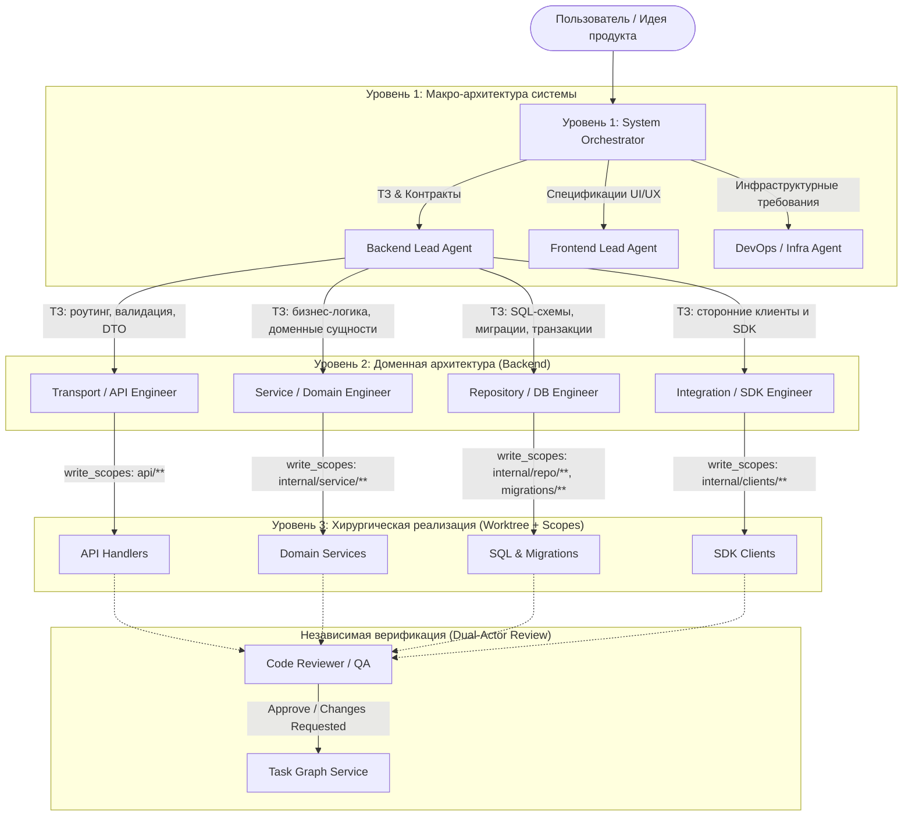

> [!IMPORTANT]
> Remove this line to confirm you've reviewed this PR before submitting.

# Zed: Multi-Agent Software Engineering IDE & Runtime

## Возможности этого форка

Этот форк превращает Zed из классического редактора кода в полноценную среду разработки и рантайм для **иерархических мультиагентных систем разработки ПО**.

Система объединяет мощь оригинального **Zed IDE** (сверхбыстрый нативный GPUI на Rust, мгновенный доступ к буферам и синтаксическим деревьям Tree-sitter, прямой контакт с языковыми серверами LSP и песочницей терминала) с многоуровневым рекурсивным оркестратором агентов, внешним Control Plane сервисом ([Task Graph Service](https://github.com/blaise-pov/tgr)) и строгой изоляцией исполнения.

Полное техническое описание архитектуры, стейт-машины и механизмов безопасности доступно в **[ARCHITECTURE.md](./ARCHITECTURE.md)**.

---

### Архитектурная парадигма: Лестница абстракций

Вместо монолитного агента, пытающегося одновременно удерживать в контексте архитектуру БД, фронтенд-стили и сетевые контракты, разработка декомпозируется по вертикали:



1. **Верхний уровень (System Orchestrator)**: принимает общую идею проекта, оперирует макро-абстракциями (`backend`, `frontend`, `infrastructure`), готовит системные спецификации и интерфейсные контракты, создавая задачи в TGS и делегируя их лидам направлений.
2. **Средний уровень (Domain Leads, например Backend Lead)**: оперирует архитектурными слоями домена (слой транспорта/API, сервисный слой бизнес-логики, слой репозиториев/хранения данных, слой внешних интеграций/SDK), готовит детальные ТЗ для каждого слоя и запускает специализированных субагентов.
3. **Нижний уровень (Layer / Component Engineers)**: сфокусированные инженеры, ограниченные хирургическими периметрами записи (`write_scopes`). Агент базы данных физически не имеет доступа к коду роутинга или фронтенда.
4. **Контроль качества (Dual-Actor Review)**: независимый профиль ревьюера проверяет изменения на соответствие исходным критериям приемки — саморевью исключено на уровне рантайма.

---

### Ключевые возможности форка

#### 1. Рекурсивное делегирование (`spawn_agent`) и граф агентов
- Субагенты могут рекурсивно порождать дочерних агентов на глубину до 5 уровней (`delegation.max_depth` в профиле и глобальный `agent.nested_sub_agents.max_depth`).
- **Строгий белый список**: агент видит в системном промпте и может вызывать только те профили, которые явно указаны в его блоке `delegation.allowed`.
- **Статическая валидация графа**: модуль `AgentGraph` при старте проверяет граф делегирования алгоритмом DFS на циклы и несуществующие профили.
- **Семафор слотов**: общий пул `SubagentSlotPool` контролирует параллелизм (`max_concurrent`), предотвращая лавинообразные затраты токенов. Дочерние треды получают префиксы глубины (`[d2] ...`).

#### 2. Декларативные профили и файловые промпты
- Профили настраиваются декларативно в `settings.json` или проектном `.zed/settings.json` (проектные профили помечаются бейджем **Project** в UI и переопределяют глобальные). Ключи раскладки (`dock`, `task_dock`, `flexible`) остаются строго пользовательскими.
- **Файловые инструкции**: специализированные промпты хранятся в файлах (`custom_prompt_path` или по соглашению `.zed/prompts/{profile_id}.md`). Редактирование в UI (**Manage Profiles**) открывает файл напрямую во вкладке Zed.
- **Кастомные Handlebars-шаблоны**: поддержка переопределения системного промпта (`agent.system_prompt_template`) и шаблона генерации названий тредов (`agent.thread_title_template`).

#### 3. Безопасность автономных агентов: Fail-Closed & Write Scopes
- **Fail-Closed для автономности**: если у профиля настроены `tool_permissions`, любые операции с исходом `Confirm` (требующие подтверждения пользователя) **автоматически отклоняются** (`PolicyDenied`). Автономный агент не зависает в фоне в ожидании клика.
- **Per-Tool Write Scopes**: файловые инструменты (`edit_file`, `write_file`, `copy_path`, `move_path`, `delete_path`, `create_directory`) ограничены списком glob-шаблонов (например, `["backend/internal/repo/**", "migrations/**"]`). Попытка записи за пределами скоупа блокируется.
- **Anti-Escape**: блокировка выхода из ворктри через симлинки и защита критических файлов (`.zed/settings.json`, `.cargo/config.toml`, `~/.agents/skills`).
- **Re-entrant Safety**: безопасная авторизация вызовов без паник от повторных заимствований мутабельного треда.

#### 4. Control Plane: Интеграция с Task Graph Service (TGS)
- В качестве внешней системы управления задачами используется [**Task Graph Service (TGS)**](https://github.com/blaise-pov/tgr) — автономный Go-демон (`cmd/taskgraph`) с SQLite WAL, подключаемый как MCP-сервер (JSON-RPC 2.0 stdio).
- **DAG и 12 состояний**: строгая стейт-машина задач с контролем ацикличности и зависимостей (`depends_on`).
- **Лизинг и автоматическое восстановление**: захват задач через `task_claim`, продление через `agent_heartbeat` и автоматический сборщик зависших задач (`recovery.Worker`).
- **Dual-Actor Safety**: встроенное разделение ролей исполнителя и ревьюера.
- Подключение настраивается через `agent.task_graph_server_id` (по умолчанию `"tgs"`) и применяется без перезапуска редактора.

#### 5. Панель задач (Task Panel) и параллельная изоляция в Git Worktree
- **Agent Task Panel** (док задается через `agent.task_dock`, иконка `ListTodo`):
  - Дерево задач: Цели → Задачи → Подзадачи со статусами (`Ready`, `Running`, `Review`, `Completed`, `Failed`, `Stale`) и номером попытки (`#attempt`).
  - Просмотр изменений задачи относительно базовой ветки (`View Task Diff`) и лента событий (`AgentTaskTimeline`).
  - Действия: запуск задачи, ручной аппрув, запрос доработок, повтор.
- **Изоляция в Git Worktrees**: для каждой исполняемой задачи автоматически создается независимая ветка `agent-task/{task_id}` и отдельная директория ворктри `agent-task-{task_id}`. Параллельные воркеры не мешают друг другу и не вызывают merge-конфликтов во время работы.

#### 6. Отказоустойчивость: Адаптивная парковка при Rate-Limit и сбоях сети
- При ошибках `429 Too Many Requests` или сетевых разрывах соединения ход не падает, а **паркуется**:
  - Экспоненциальный опрос: 60с → 120с → 240с → потолок 300с (общий настраиваемый бюджет до 5 часов).
  - Обратный отсчет в UI с возможностью немедленного перезапуска или отмены.
  - Полная история и контекст дерева агентов сохраняются в памяти.

#### 7. Скиллы (Default-Deny) и переменные `.env`
- **3-уровневая фильтрация скиллов**: каталог промпта, slash-команды и runtime-инструмент `skill`. Для кастомных профилей без списка `skills` действует политика **default-deny**.
- **Интеграция с `.env`**: автоматическая загрузка и реактивное обновление переменных окружения из корня проекта. Подстановка `${VAR}` и `${VAR:-default}` в модели и параметры MCP-серверов.

---

### Пример конфигурации: «Лестница абстракций» в действии

```jsonc
// .zed/settings.json
{
  "agent": {
    "default_profile": "orchestrator",
    "task_graph_server_id": "tgs",
    "nested_sub_agents": {
      "enabled": true,
      "max_depth": 3,
      "max_concurrent": 12
    },
    "profiles": {
      // 1. Уровень системы: Архитектор
      "orchestrator": {
        "name": "System Architect",
        "description": "Decomposes feature into architectural modules and delegates to leads",
        "custom_prompt_path": ".zed/prompts/orchestrator.md",
        "default_model": { "provider": "anthropic", "model": "claude-sonnet-latest" },
        "delegation": {
          "allowed": ["backend-lead", "frontend-lead", "reviewer"],
          "max_depth": 3
        },
        "tool_permissions": {
          "default": "deny",
          "tools": {
            "read_file": { "default": "allow" },
            "grep": { "default": "allow" },
            "find_path": { "default": "allow" },
            "edit_file": { "default": "allow", "write_scopes": ["docs/**", "specs/**"] },
            "write_file": { "default": "allow", "write_scopes": ["docs/**", "specs/**"] }
          }
        }
      },

      // 2. Уровень домена: Бэкенд-лид
      "backend-lead": {
        "name": "Backend Lead",
        "description": "Decomposes backend requirements into layer tasks and delegates",
        "custom_prompt_path": ".zed/prompts/backend_lead.md",
        "default_model": {
          "provider": "anthropic",
          "model": "claude-sonnet-latest"
        },
        "skills": ["go", "postgres", "clean-architecture"],
        "delegation": {
          "allowed": ["transport-engineer", "repository-engineer", "service-engineer"],
          "max_depth": 2
        },
        "tool_permissions": {
          "default": "deny",
          "tools": {
            "read_file": { "default": "allow" },
            "grep": { "default": "allow" },
            "find_path": { "default": "allow" },
            "edit_file": { "default": "allow", "write_scopes": ["backend/api/**", "backend/internal/domain/**"] },
            "write_file": { "default": "allow", "write_scopes": ["backend/api/**", "backend/internal/domain/**"] }
          }
        }
      },

      // 3. Уровень слоя: Инженер базы данных (быстрая кодовая модель)
      "repository-engineer": {
        "name": "Repository & DB Engineer",
        "description": "Implements repository layer, queries and database migrations",
        "custom_prompt_path": ".zed/prompts/repository_engineer.md",
        "default_model": {
          "provider": "anthropic",
          "model": "claude-haiku-latest"
        },
        "skills": ["sql", "postgres"],
        "tool_permissions": {
          "default": "deny",
          "tools": {
            "read_file": { "default": "allow" },
            "grep": { "default": "allow" },
            "find_path": { "default": "allow" },
            "edit_file": {
              "default": "allow",
              "write_scopes": ["backend/internal/repository/**", "backend/migrations/**"]
            },
            "write_file": {
              "default": "allow",
              "write_scopes": ["backend/internal/repository/**", "backend/migrations/**"]
            },
            "terminal": {
              "default": "deny",
              "always_allow": [{ "pattern": "^go\\s+test\\s+\\./backend/internal/repository/\\.\\.\\." }]
            }
          }
        }
      },

      // Уровень верификации: Ревьюер (альтернативная модель для независимой проверки)
      "reviewer": {
        "name": "Code Reviewer",
        "description": "Reviews completed tasks against acceptance criteria",
        "custom_prompt_path": ".zed/prompts/reviewer.md",
        "default_model": {
          "provider": "openai",
          "model": "gpt"
        },
        "tools": {
          "edit_file": false,
          "write_file": false,
          "terminal": false
        }
      }
    },
    "context_servers": {
      "tgs": {
        "command": "taskgraph",
        "args": ["serve", "--project", "${ZED_PROJECT_PATH}"],
        "env": {
          "TGR_PROJECT_ID": "${ZED_PROJECT_ID}",
          "TGR_AUTH_TOKEN": "${TGR_TOKEN:-default_token}"
        }
      }
    }
  }
}
```

---

[](https://zed.dev)
[](https://github.com/zed-industries/zed/actions/workflows/run_tests.yml)

Welcome to Zed, a high-performance, multiplayer code editor from the creators of [Atom](https://github.com/atom/atom) and [Tree-sitter](https://github.com/tree-sitter/tree-sitter).

---

### Installation

On macOS, Linux, and Windows you can [download Zed directly](https://zed.dev/download) or install Zed via your local package manager ([macOS](https://zed.dev/docs/installation#macos)/[Linux](https://zed.dev/docs/linux#installing-via-a-package-manager)/[Windows](https://zed.dev/docs/windows#package-managers)).

Other platforms are not yet available:

- Web ([tracking discussion](https://github.com/zed-industries/zed/discussions/26195))

### Developing Zed

- [Building Zed for macOS](./docs/src/development/macos.md)
- [Building Zed for Linux](./docs/src/development/linux.md)
- [Building Zed for Windows](./docs/src/development/windows.md)

### Contributing

See [CONTRIBUTING.md](./CONTRIBUTING.md) for ways you can contribute to Zed.

Also... we're hiring! Check out our [jobs](https://zed.dev/jobs) page for open roles.

### Licensing

Zed source code is licensed primarily under GPL-3.0-or-later, with Apache-2.0 components where marked.

License information for third party dependencies must be correctly provided for CI to pass.

We use [`cargo-about`](https://github.com/EmbarkStudios/cargo-about) to automatically comply with open source licenses. If CI is failing, check the following:

- Is it showing a `no license specified` error for a crate you've created? If so, add `publish = false` under `[package]` in your crate's Cargo.toml.
- Is the error `failed to satisfy license requirements` for a dependency? If so, first determine what license the project has and whether this system is sufficient to comply with this license's requirements. If you're unsure, ask a lawyer. Once you've verified that this system is acceptable add the license's SPDX identifier to the `accepted` array in `script/licenses/zed-licenses.toml`.
- Is `cargo-about` unable to find the license for a dependency? If so, add a clarification field at the end of `script/licenses/zed-licenses.toml`, as specified in the [cargo-about book](https://embarkstudios.github.io/cargo-about/cli/generate/config.html#crate-configuration).

## Sponsorship

Zed is developed by **Zed Industries, Inc.**, a for-profit company.

If you’d like to financially support the project, you can do so via GitHub Sponsors.
Sponsorships go directly to Zed Industries and are used as general company revenue.
There are no perks or entitlements associated with sponsorship.
